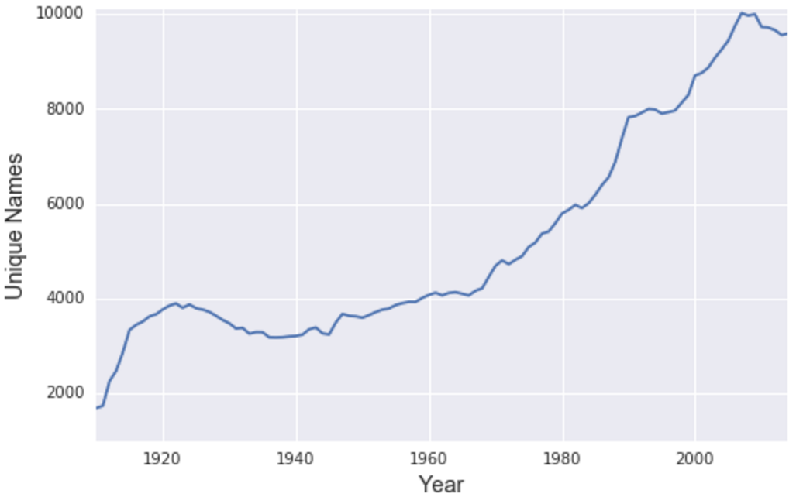
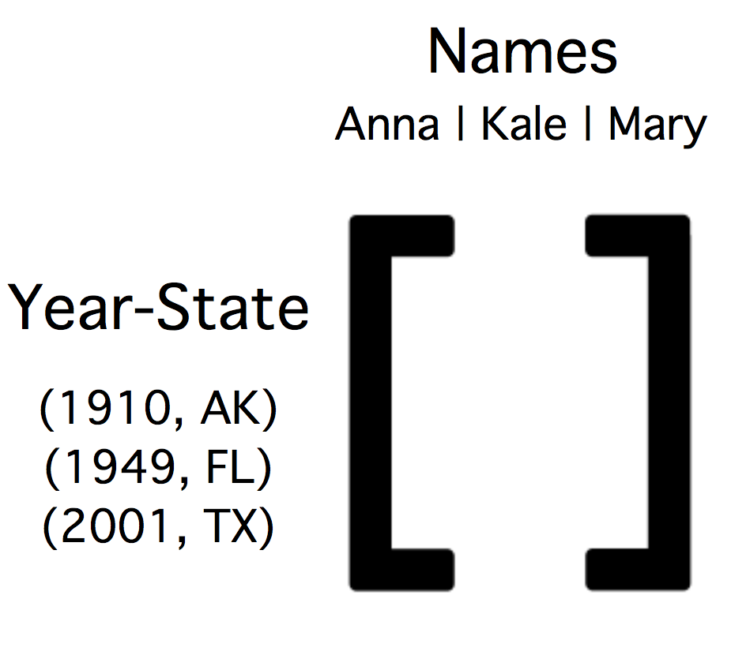
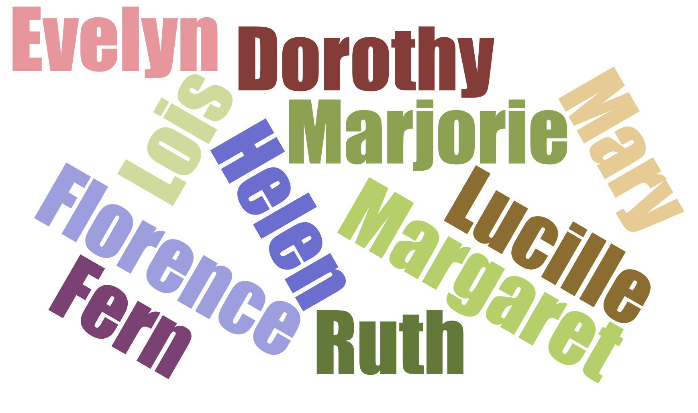
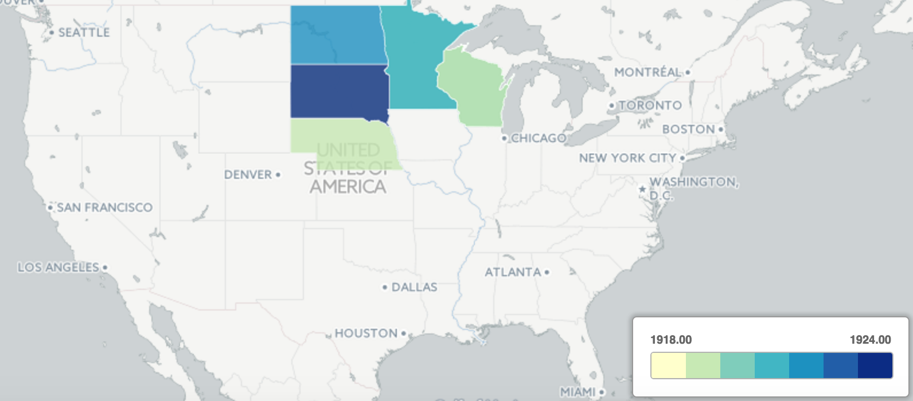
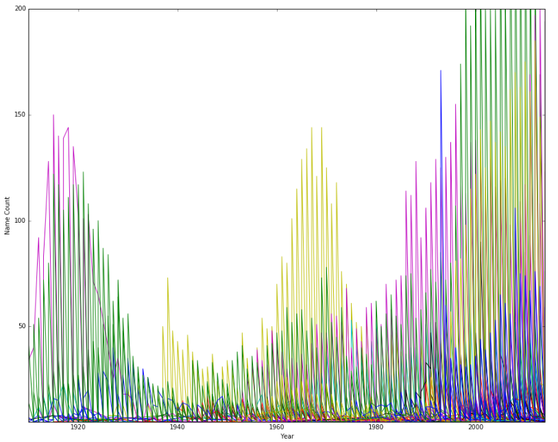

# What's in a Name?

## Latent naming features in America

### Introduction

The aim of this project is to find subsurface relationships in vectors of names over time in the United States as a means to provide people looking for naming inspiration with new ideas. Doing straight time series analysis on the dataset has already been done, and the goal of this project is to provide an alternative approach to finding name trends. There are two main components of the analysis and resulting model:

1. Normalization of name count data (broken down by state and year) over the past century using TF-IDF vectorization;
2. Pulling latent features from the data using non-negative matrix factorization that can be compared to a user's own naming preferences to provide.

The result of the model will be a list of latent features which are described by a series of names and geographies associated with that latent feature. Key to why this is relevant for parents today is the fact that there is clearly a preference for finding unique names for children, and this preference has become more pronounced over time.

There are about **5x** as many unique names given to children per year today compared with a century ago. This recommendation system is a useful tool for parents to use to find new names that are not directly tied to their geographic and time proximity bias (the tendency to think more readily of names that are in their pop-culture sphere).

### Data

The data for this project comes from US Social Security Administration. There is a [clean Kaggle dataset](https://www.kaggle.com/kaggle/us-baby-names) of name counts from 1910-2014. Counts of first names are broken down by US state and year, with a gender specified for each name. 

#### Data Preparation

Beyond the intuitive reasoning that it is clearly helpful for additional naming  

In order to model the name relationships, I formulated a matrix for each male and female names. This allows for the analysis to focus on the latent features associated with preferences for each gender. (Interesting point: there are about **2x** as many unique female names compared to male names.) The resulting matrix was in this format which is showing the naming preferences for each state-year:

### Normalization - Vectorization

I normalized the data in order to limit the influence of highly popular names over time and states with large populations. I found that TF-IDF vectorization was effective for this normalization, and it appears to be a new approach to analyzing name data. Just like using TF_IDF down-weights the importance of the word “the” and longer documents in NLP, it has done the same here.

This allowed for medium-popular names and smaller states to also show up in latent feature descriptions. In effect, the model produces a more diverse set of latent features, which allows for a nuanced set of names suggestions to surface (think sub-genres like Bill Murray films or British comedy recommendations in movie terms).

### Matrix Factorization

To extract latent features from this matrix, I applied non-negative matrix factorization. NMF produces two matrices, one which connects the relationship between latent features and year-state, the other which connects first names to latent features.

NMF is better for this analysis than PCA dimensionality reduction or SVD matrix factorization, because keeping the values of the factored matrices positive lines up with our intuitive understanding of name popularity (which are all based in positive values).

NMF also enables us to distill the data down to parts-specific latent features, in this case latent features associated with a specific group of names or a specific state and time period—compared with making generalizations about important features for the entire US as a whole for the entire past century at once.

### Application

Let’s say I’m a to-be parent who is interested in naming my daughter something akin to my favorite Game of Thrones characters. I create a vector of names with my “votes” for each name, and run it through the model. Here the larger the name, the stronger my preference for that name.

After transforming the vector through the model, we can rank which latent features are weighted strongest and produce a list of the year-states and names which best describe those latent features. There is now a list of new names with a geographic-timestamp to add some flavor to my naming research.

**Names**

**Geography-Time Period**

As the map shows, the latent features from the model are often distinct groups of years and geographic regions. In this case, the populations from the upper Midwest named their daughters similarly to Game of Thrones characters. I can adjust the model to return more names, so that if I don't like the top five recommendations there are additional options for inspiration. As such, if I get a couple additional names that I like, I can update my list and input a new vector into the recommender.

### Takeaways and Further Work

While the model incorporates time into the data by creating separate rows for each year-state combination, it would still be interesting to apply time series analysis on the latent features that are pulled from the data set. Doing so would allow for the projection of a group of names out into the future (after testing the model on subsections of data) and determine how much predictive power this adds to just projecting out single names into the future. As we can see from this figure, projecting single name popularity into the future can be noisy:

In addition, it would be interesting to do more feature engineering with the name data. The current model uses entire names as features, and there is room to analyze the trends of phonemes that names are composed of and see what latent features arise from that factorization. This would allow for us to test compare latent features and recommendations, and indicate if it is more effective to judge preferences based on the components of a name or the name in its entirety.
